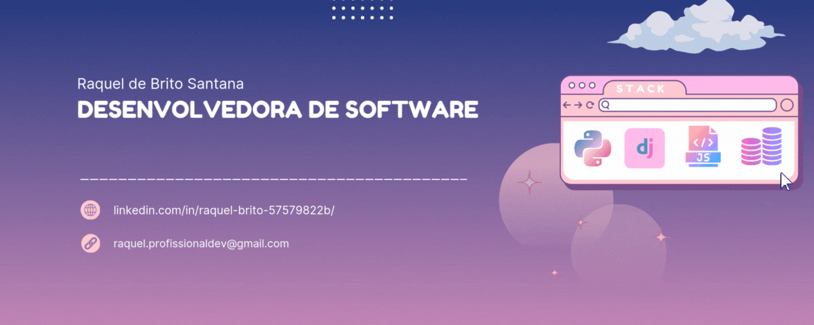

  

  

***

## Olá, eu sou a Raquel! 👩🏽‍💻

Sou estudante de **Análise e Desenvolvimento de Sistemas** na **UNIJORGE** e apaixonada por tecnologia! Estou sempre em busca de novos desafios e aprendizado. Adoro programar, explorar novas ferramentas e tecnologias, além de trabalhar em projetos que envolvem **Python**, **Django** e **Banco de Dados**. 

Com uma forte curiosidade e sede de conhecimento, acredito no poder da tecnologia para transformar o mundo ao nosso redor. 

Atualmente, estou me dedicando ao desenvolvimento de sistemas e buscando aprimorar minhas habilidades no campo da **programação back-end**. Se você tiver interesse em conversar sobre tecnologia ou projetos, fique à vontade para me contatar! 😊
